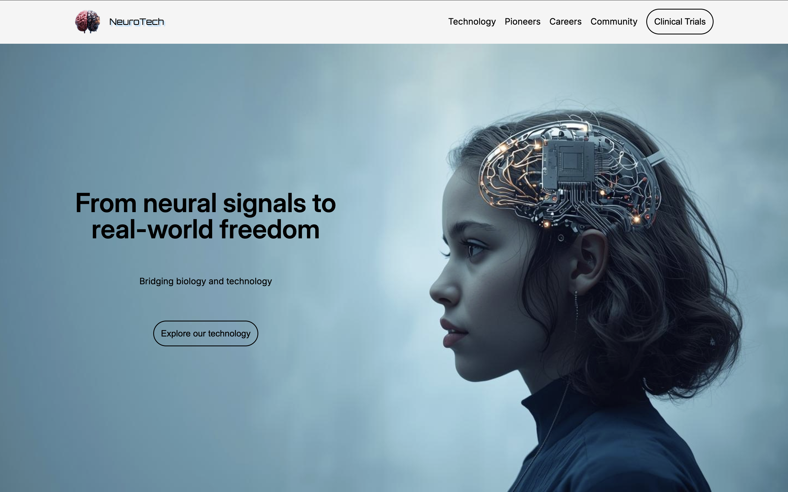
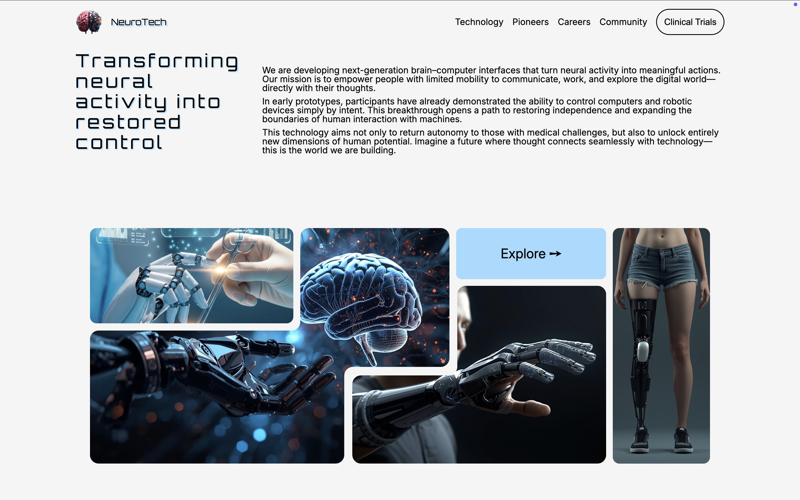
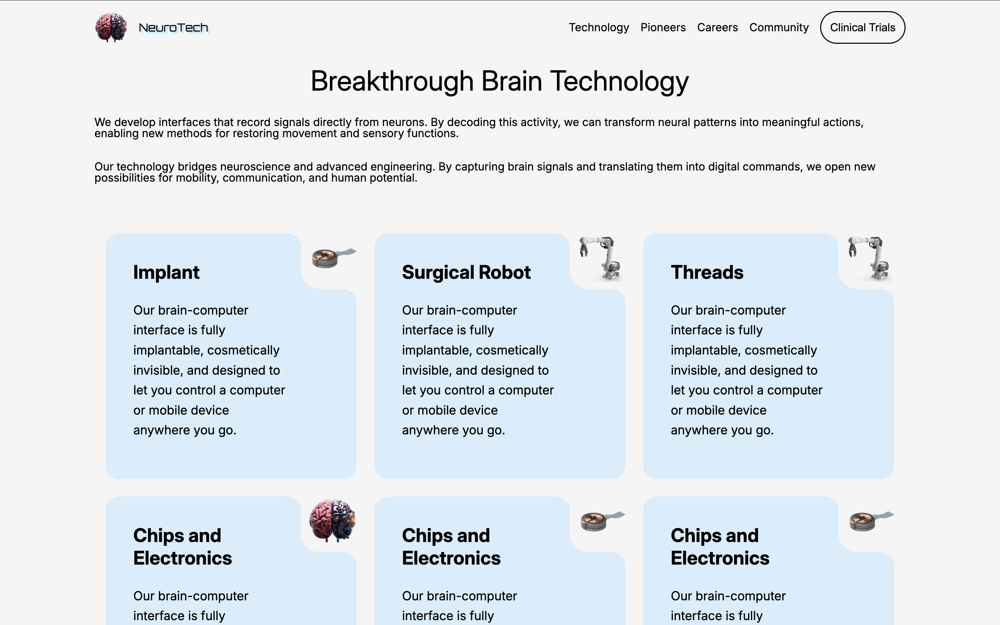
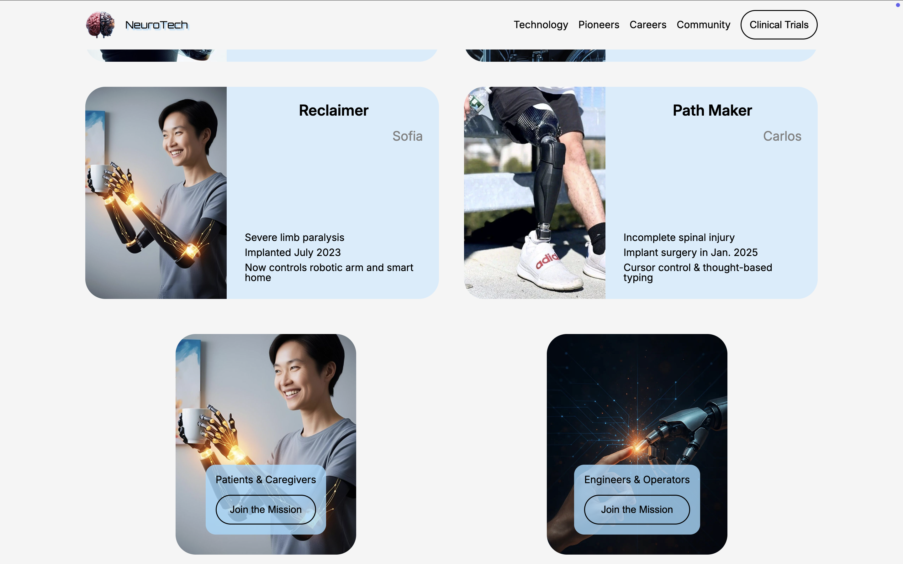
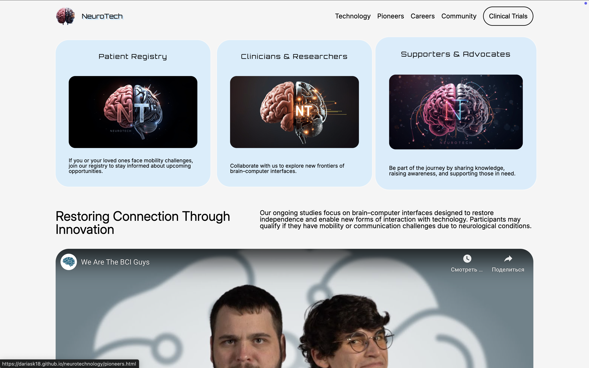
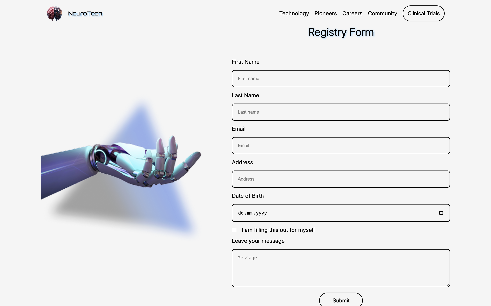

# Neurotechnology Prototype

A responsive web application prototype inspired by **Brain-Computer Interface (BCI)** concepts.  
Built with **HTML5, CSS**, this project demonstrates interactive UI components, form, and a clean modular structure.  

---

## 🚀 Features
- Responsive design for mobile and desktop
- Interactive UI components
- Form validatio
- Organized Git workflow with branching and pull requests

---

## 🛠️ Tech Stack
- **Languages:** HTML5, CSS3  
- **Tools:** Git, GitHub, VS Code  

---

## 📸 Screenshots

<!-- 

 -->

---

## 🌱 Future Improvements

- Add state management (Vuex / Pinia)
- Integrate Firebase for real-time data
- Enhance UI with SCSS

---

## 👩‍💻 Author
Developed by [Daria Steblovska](https://github.com/DariaSK18)
